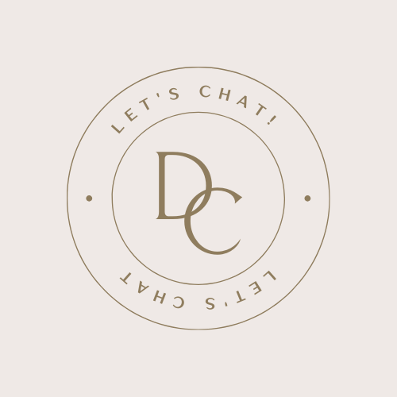
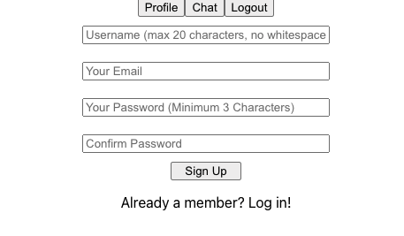
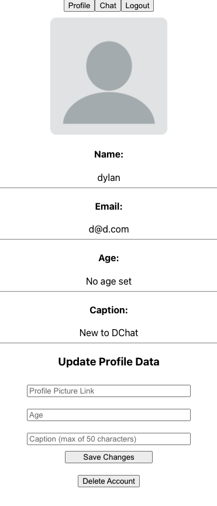
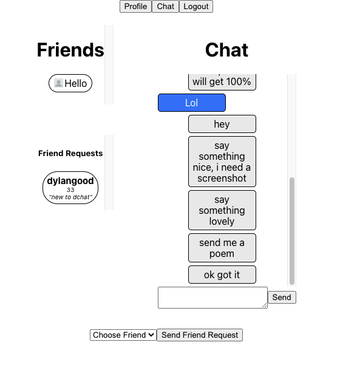
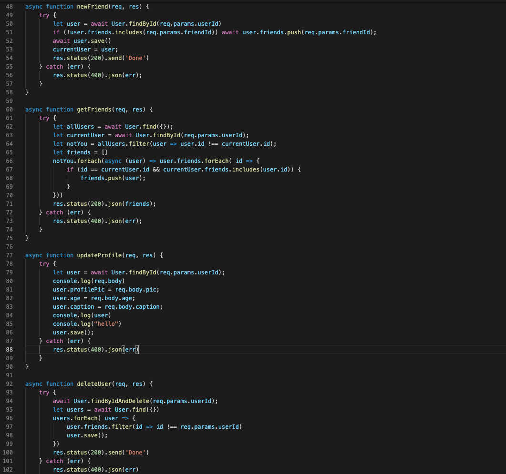
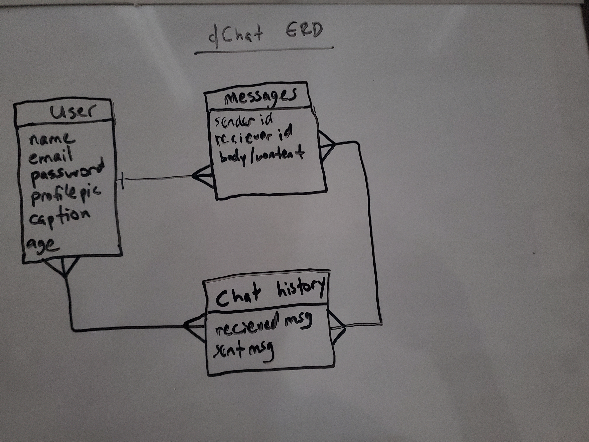
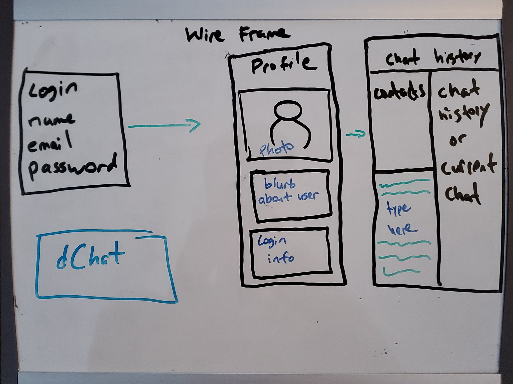

# dChat 

  

## What is dChat?
dChat is a chat application that allows a user to build a list of contacts and chat in a live environment. 

## How does it work?
Access the application [here](https://dchatapplication.herokuapp.com/). You will be routed to the initial profile screen. If it is your first time using dChat then fill in all fields and click "Sign Up". If you are already a loyal member of dChat you can click "Already a member" and will be re-routed to the familiar login page. 

Clicking "Chat" in the nav bar will bring you to your chat section that holds all your current friends, chat history, and friend requests. To accept a friend request click the name and once it turns green you can add them. The names will remain green so you can see which friends were just added to your list. 

To speak with a contact simply click their name in the Friends list and their chat history will open on the right. 

You can update your profile live in the Profile section. 

**View my Trello board [here](https://trello.com/b/1DVn7srQ/dchat)!**

## Application Screenshots
- This is an image of the inital profile sign up
  

  
- Screenshot of your initial profile. In order to update type into the sections at the botton and add any image address to update your profile link - it can even be a google image! 
  

  
- An example conversation on the right. You can see there is a friend request from "dylangood" on the left. In order to add him just click the name and once it turns green they are able to be added. 
  

## Code Sample
 
- This is a code snippet of the backend controller functions that perform CRUD on the user.
  

  
- View my ERD here:
 

## WireFrame
- Below is the original design of my application. Beginning with the sign in page to how I wanted the chat to look. The final design is very similar to how I wanted it to look. 
 

## Technologies Used
- Node.js
- Express.js
- MongoDb
- Mongoose
- socket. io
- Heroku 
- HTML
- CSS 
- Javascript
- GIT 
- mongoDB Compass
- ReactJS

## Use the app on Heroku! 
Click <a href="https://dchatapplication.herokuapp.com/" target="_blank" rel="noopener noreferrer">here</a> to access the app. 
  
## About the Creator 
This is the first project applying ReactJS to the MERN stack by **Dylan Burston.**
- **[Linkedin](https://www.linkedin.com/in/dylan-burston-09727265/)**